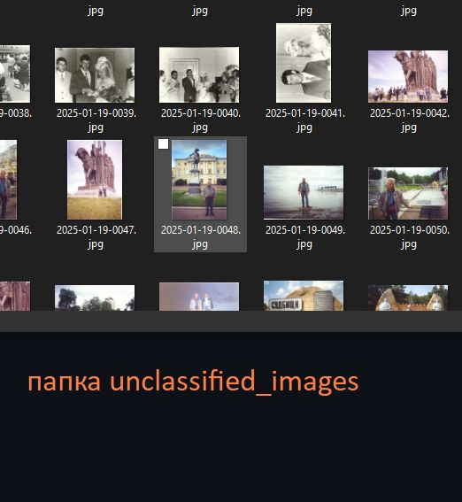
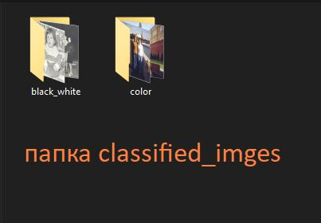
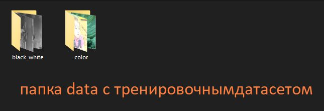

# color_classifier

# Нейросеть для классификации изображений


Этот проект представляет собой нейросеть, классифицирующую фотографии как черно-белые или цветные.

## Возможности
- Вывод точности классификации
- Обучение на собственных данных
- Ранняя остановка для предотвращения переобучения
- Возможность дообучения с использованием сохраненных весов
- Автоматическая сортировка изображений по папкам


## Запуск
Вы можете запустить модель локально или в Google Colab. 

### 1. Локальный запуск
Структура данных
```
unclassified_images/
  ├── img1.jpg
  ├── img2.jpg
  └── ...

classified_images/
  ├── black_white/
  │   ├── img1.jpg
  │   ├── img2.jpg
  │   └── ...
  ├── color/
  │   ├── img1.jpg
  │   ├── img2.jpg
  │   └── ...
```






2. Запустите скрипт для обучения
  
3. После обучения модель сохранит веса и будет готова к классификации новых изображений.


## Форматы изображений
Модель поддерживает форматы: JPEG, PNG, BMP.

## Архитектура модели
Модель состоит из нескольких сверточных слоев, слоев подвыборки, dropout и полносвязных слоев:
```python
model = Sequential([
    BatchNormalization(),
    Conv2D(32, (3, 3), activation='relu', input_shape=(64, 64, 3)),
    MaxPooling2D((2, 2)),
    Conv2D(64, (3, 3), activation='relu'),
    MaxPooling2D((2, 2)),
    Dropout(0.5),
    Conv2D(128, (3, 3), activation='relu'),
    MaxPooling2D((2, 2)),
    Flatten(),
    Dense(128, activation='relu'),
    Dense(1, activation='sigmoid')
])
```

## Дообучение с предобученными весами
Если требуется дообучение, можно загрузить сохраненные веса:
```python
model.save_weights("model_weights.weights.h5")
model.load_weights("model_weights.weights.h5")

history_finetune = model.fit(
    train_generator,  
    steps_per_epoch=len(X_train) // 32,  
    validation_data=validation_generator,  
    epochs=20,  
    callbacks=[early_stopping]
)
```

## Визуализация обучения
График точности модели по эпохам:
```python
import matplotlib.pyplot as plt

plt.figure(figsize=(10, 6))
plt.plot(history.history['accuracy'], label='Точность на обучении', color='blue', linestyle='-', marker='o')
plt.plot(history.history['val_accuracy'], label='Точность на валидации', color='orange', linestyle='--', marker='x')
plt.title('Точность модели на обучении и валидации', fontsize=16)
plt.xlabel('Эпоха', fontsize=12)
plt.ylabel('Точность', fontsize=12)
plt.legend(loc='lower right', fontsize=12)
plt.grid(True)
plt.tight_layout()
plt.show()
```

## Классификация новых изображений
После обучения можно классифицировать новые изображения и распределить их по папкам:
```python
classify_and_copy_images("unclassified_images", "classified_images", model)
```


## Лицензия
Проект разработан **landshaft_band**. Доступен для свободного использования.

